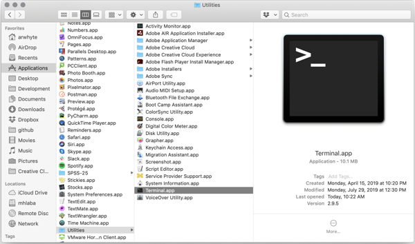
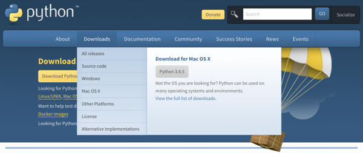
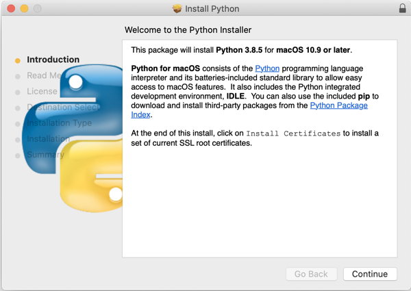

# macOS: Installing Python 3.x

There are several ways to install and manage Python on the Mac. The install steps that I describe
below are arguably the simplest approach to getting Python 3 up and running on your machine.

:exclamation: As of 20 July 2020 the latest stable
[release](https://www.python.org/downloads/mac-osx/) in the Python 3.x series is Python 3.8.5. You
can also run Python 3.7 (3.7.8 is the latest maintenance release) if already installed.

## 1.0 Check for previous install

First, confirm whether or not Python is installed on your machine.

### 1.1 Locate and open Terminal.app

Mac includes a Unix terminal called `Terminal.app` that you can use to issue Bash shell commands.
Use `Finder` to locate `Terminal.app` in the directory `Applications/Utilities/`. You can traverse
the directory structure by clicking on each folder or use the keyboard shortcut:
(`Command + Shift + U`).

:bulb: I recommend dragging the `Terminal.app` icon to your dock in order to simplify accessing
`Terminal.app` in future (you will be using it frequently).



Double-click the Terminal.app icon to open it. The terminal opens with a white background. If you
want to change the background color see the following _StackExchange_
[thread](https://apple.stackexchange.com/questions/92756/how-do-you-change-mac-terminal-theme-so-that-it-doesnt-go-back-to-basic-every).


:exclamation: To close a terminal session type 'exit' at the prompt and then press __Return__ key.

### 1.2 Check if Python 3.x is installed

At the prompt, type the following line `python --version` and then press the __Return__ key:

```commandline
$ python --version
Python 2.7.10
```

Mac comes with Python 2.7.x pre-installed. Python 2.x is considered
[retired](https://www.python.org/doc/sunset-python-2/) and no longer supported as of 1 January 2020.

:exclamation: You need Python 3.x. Check and see if you have Python 3.x installed using the "python3" command
alias:

```commandline
$ python3 --version
Python 3.8.5
```

If Python 3.8.x or 3.7.x is installed you are in good shape and need do nothing more. _Proceed no
further and exit this install guide_.

The more likely scenario is that _no version information is returned_. No problem, installing
Python 3.x is not difficult.

## 2.0 Download and install Python 3.x

Once you've checked your machines for previous Python installs, visit the Python Software Foundation
[website](https://www.python.org) and download the lastest stable Python 3.x release.

### 2.1 Download Python 3.x

Hover over "Downloads" on the blue menu bar. Your macOS operating system version should have been
detected on the page load (misidentified as Mac OS X--the old name) and the link to the Python 3.8.x
release package displayed as a grey button. Click the grey button to download the install package.



### 2.2 Install Python 3.x

Once downloaded to your `Downloads` directory, double-click the Python 3.8.x `*.pkg` file. Click the
"Continue" button and proceed with the installation. I recommend installing Python 3 in the default
`Applications` directory.



### 2.3 Confirm installation

Once installed return to Terminal.app and confirm that Python 3 has been installed successfully.

```commandline
$ python3 --version
Python 3.8.5
```

## 3.0 Source code editor

The Python installer also installs Python's Integrated Development and Learning Environment (IDLE).
The `IDLE` app provides a multi-window text editor, interactive shell window, search/replace, and
debugger. It is one of several text editors that you can use to write and test Python code. To learn
more about IDLE see
[https://docs.python.org/3/library/idle.html](https://docs.python.org/3/library/idle.html).


:exclamation: The SI 506 teaching team __does not__ use IDLE. Instead, we use Microsoft's popular
(and free) [Visual Studio Code](https://code.visualstudio.com/) which serves as the default source
code editor for this course. See the companion guide
[macOS: Installing Visual Studio Code](mac-install_vscode_with_py_extension.md) for installation
instructions.

## License
<a rel="license" href="http://creativecommons.org/licenses/by/4.0/"></a><br />This work is licensed under a <a rel="license" href="http://creativecommons.org/licenses/by/4.0/">Creative Commons Attribution 4.0 International License</a>.
