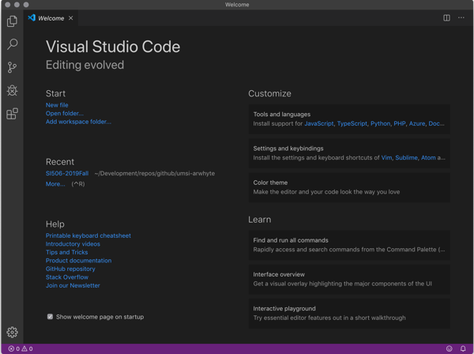
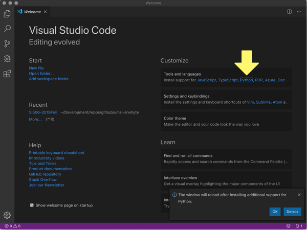
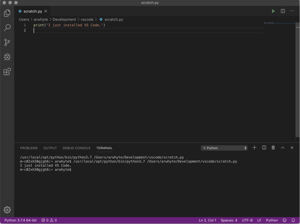

# macOS: Installing Visual Studio Code

## Overview

[Visual Studio Code](https://code.visualstudio.com/) (a.k.a VS Code) is a popular source code editor
that runs on Windows, Mac, and Linux. It features built-in support for a variety of software
languages as well as extensions for languages such as Python.

Follow this guide to acquire, install, and configure VS Code as a Python source code editor. The
guide assumes that you have previously installed Python 3.x.

* <a href="#vscode">1.0 Download and install Visual Studio Code</a>
* <a href="#extensions">2.0 Add Visual Studio Code extensions</a>
* <a href="#write_code">3.0 Write some code</a>
* <a href="#appendix_a">Appendix A. Managing extensions</a>

## <a name="vscode"></a>1.0 Download and install Visual Studio Code

Visual Studio Code serves as the default source code editor for SI 506. The teaching
team utilizes VS Code as a teaching tool during lectures, labs, demos, in-class exercises, etc. We
recommend highly that you install it in order to synch your local development environment with that
of the teaching team.

Note that alternative products exist in the marketplace. Besides Python's own
[IDLE](https://docs.python.org/3/library/idle.html) app, popular editors and integrated development
environments (IDEs) include [PyCharm](https://www.jetbrains.com/pycharm/), [Atom](https://atom.io/),
[Sublime Text](http://www.sublimetext.com/), and the Eclipse [Theia](https://theia-ide.org/)
cloud (i.e., in-browser) and desktop IDE. Note that to use Jet Brain's
[PyCharm](https://www.jetbrains.com/pycharm/) you _must_ apply for a free
[student license](https://www.jetbrains.com/student/).

:warning: You may prefer to run a different source code editor than VS Code. You are free to do so.
However, the teaching team will assume that you know how to install, configure, and maintain your
preferred source code editor or IDE without the need of our assistance. Our focus is VS Code.

### 1.1 Download Visual Studio Code

Visit the VS Code [website](https://code.visualstudio.com/). Your operating system version should
have been detected on the page load and the link to the VS Code stable build displayed as a blue
button. Click the button to download the install package.


### 1.2 Install Visual Studio Code

Open the Finder and locate the archive file `VSCode-darwin-stable.zip` in your `Downloads` directory
(assuming, of course, that your downloads are saved to this directory location). Double-click the
file to uncompress the contents. `Visual Studio Code.app` should now appear in your `Downloads`
directory. Drag `Visual Studio Code.app` to your `Applications` directory.

:bulb: Once you've added `Visual Studio Code.app` to your `Applications` directory, you can drag
the blue program icon to the dock to simplify accessing the application.

Click the VS Code icon to the start the program and display its welcome page.



:bulb: VS Code's user documentation is both helpful and friendly. Commence with the
[Getting Started](https://code.visualstudio.com/docs) section of the documentation, in particular
the [user interface](https://code.visualstudio.com/docs/getstarted/userinterface) overview. The
VS Code team has also produced a set of
[introductory videos](https://code.visualstudio.com/docs/getstarted/introvideos) that are worth
watching.

## <a name="extensions">2.0 Add Visual Studio Code extensions

VS Code is highly customizable. It features an extensions marketplace that allows users to install
third-party extensions to enhance the development environment. See the VS Code
[Extension Marketplace](https://code.visualstudio.com/docs/editor/extension-gallery) page for more
information on how to search, install, and manage extensions.

For SI 506 we need you to install the following two extensions (in the following order):

* Python (required)
* Bracket Pair Colorizer
* Trailing spaces
* vscode-icons

### 2.1 Install the Python extension (required)

The Python extension provides rich support for the Python language, including intellisense, code
formatting, linting, debugging, and other useful features. This is a required extension that you
__must__ install.

Under "Customize" on the right side of the welcome page, click the "Python" link under "Tools and
languages" to add the Python extension. Click the blue "OK" button in the pop up dialog (lower
right). The welcome page will reload with the "Python" link greyed out. Hover over the link with
your cursor and confirm that "Python support is already installed."



With the Python extension installed VS Code is ready for you to start coding.

However, there are other useful extensions you should consider installing in order to enrich VS
Code's user interface. Below are three extensions that I recommend.

### 2.2 Install the Bracket Pair Colorizer extension

This useful extension colorizes matching brackets and braces as an aid to identification.

On the left-side of the VS Code user interface is positioned a vertical activity bar containing the
following icons:

* File explorer: two layered docs icon
* Search: magnifying glass icon
* Source Control: three dots connected by 2 lines icon
* Debugger: triangle overlayed with a bug
* Extensions: three connected tiles and one disconnected tile

Click on the "Extensions" icon to open the extensions marketplace. In the search box type "Bracket
Pair Colorizer". After the extension is retrieved, click the green "Install" button.


### 2.3 Install the Trailing Spaces extension

Another useful extension that highlights extra and unnecessary trailing spaces found in your
code. Besides manual clean up, the extension provides an easy means to delete trailing spaces found
in the file that you are currently editing.

Click on the "Extensions" icon to open the extensions marketplace. In the search box type
"Trailing Spaces". After the extension is retrieved, click the green "Install" button.

### 2.4 Install the vscode-icons extension

Delightful eye candy that provides an extended set of directory and file icons that simply file type
recognition.

Click on the "Extensions" icon to open the extensions marketplace. In the search box type
"vscode-icons". After the extension is retrieved, click the green "Install" button.

:warning: Once installed restart VS code (i.e., close/open the app). You should then be presented
with a message to activate the new icons.

## <a name="write_code"></a>3.0 Write some code

On the welcome page under "Start" click "New file". Write the following line of code:

```python
print('I just installed VS Code.')
```

Then save the file with the name `scratch.py`.

:bulb: A dialog box will appear (lower right) stating that the linter
[Pylint](https://www.pylint.org/) is not installed.

A linter is a tool that analyzes source code for syntax and style errors, bugs, and other suspect
code. Although linters can prove annoying on occasion (they can be configured to reduce noise) I
recommend installing it. If you choose to install it VS Code will launch a terminal to perform the
install. Once installed type "exit" at the command prompt and then press __Enter__ to close the
terminal.

Now, click the green run icon (upper right) to run `scratch.py`. VS Code will start the terminal and
run your file.



## <a name="appendix_a"></a>Appendix A. Managing extensions

VS Code makes it easy to manage your extensions. You can install, disable, update, and uninstall
extensions through the activity bar extensions view, the Command Palette (commands have the
Extensions: prefix) or command-line switches.

### A.1 View installed extensions

Click on the activity bar extensions icon. The extensions view will be displayed. Click on the three
dots ("...") to the right of the "EXTENSIONS" heading. Select "Show Enabled Extensions." The
extension(s) that you have installed will be listed.

### A.2 Recommended/Popular extensions

Again click on the three dots ("...") to the right of the Extensions heading, and select "Show
Recommended Extensions." You will be presented with a number of recommended extensions which you can
install once you become more familiar with VS Code, Git, Github and other technologies and platforms.

### A.3 Uninstall/Disable extensions

To uninstall an extension, click the extensions icon in the activity bar. Scan your "enabled"
extensions and then click the gear icon to the right of the extension entry. Choose "Uninstall" from
the drop-down menu. This will uninstall the extension and prompt you to reload VS Code.

If you don't want to permanently remove an extension, you can instead disable it temporarily by
clicking the gear icon and selecting "Disable". You can disable an extension either globally
or just for the current workspace. You will be prompted to reload VS Code after you disable an
extension.

If you need to disable all installed extensions, click on the three dots ("...") to the right of the
Extensions heading and select "Disable All Installed Extensions". Extensions remain disabled for all
VS Code sessions until you re-enable them.

## License
<a rel="license" href="http://creativecommons.org/licenses/by/4.0/"></a><br />This work is licensed under a <a rel="license" href="http://creativecommons.org/licenses/by/4.0/">Creative Commons Attribution 4.0 International License</a>.
